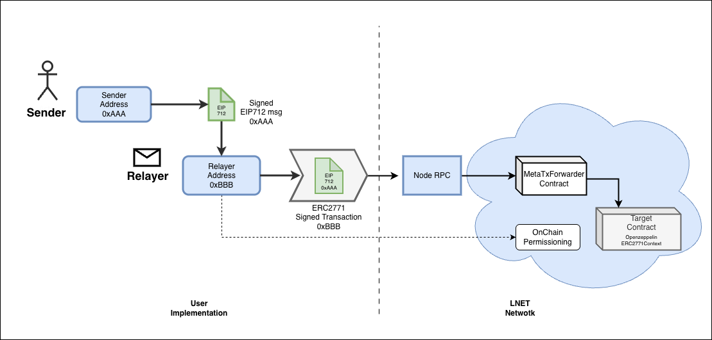

# MetaTx 
## Deploy and Test a Storage Contract


A Hardhat project for deploying and testing meta-transaction enabled smart contracts on LNet networks. This project demonstrates ERC-2771 meta-transaction implementation using OpenZeppelin's `ERC2771Context`.

## Overview

This project includes a `Storage` contract that supports meta-transactions through **LNet's trusted forwarder**, allowing gasless transactions where a relayer is authorized to send tx to the network.

## Features

- ✅ ERC-2771 meta-transaction support via OpenZeppelin
- ✅ Storage contract with owner-controlled operations
- ✅ Deployment scripts for LNet testnet and mainnet
- ✅ Optimized Solidity compiler settings with IR pipeline
- ✅ Zero gas price configuration for LNet networks

## Architecture



## Prerequisites

- Node.js (v14 or higher)
- npm or yarn
- A private key for the relayer account
- Relayer Address Permissioned and Gas Limit configured by LNet support team
- Deployer Address Permissioned and Gas Limit bucket configured by LNet support team

## Installation

```bash
npm install
```

## Configuration

Create a `.env` file in the root directory:

```bash
NETWORK=LNET
RELAYER_PK=your_relayer_private_key_here
SENDER_PK=your_sender_private_key_here

```

### Network Configuration

The project is configured for two LNet networks:

**LNet Testnet:**
- RPC URL: `[url_mainnet_node]`
- Chain ID: `648540`
- Hub Address: `0x9a49A9e7b5b07CDd6218624687D3C9FD30e853Bd`

**LNet Mainnet:**
- RPC URL: `[url_testnet_node]`
- Chain ID: `648541`
- Hub Address: `0x1B5c82C4093D2422699255f59f3B8A33c4a37773`

## Contract: Storage.sol

A simple storage contract with meta-transaction support:

- `store(uint256)` - Store a number (anyone)
- `retrieve()` - Retrieve the stored number
- `increment()` - Increment the stored number (owner only)
- `reset()` - Reset the stored number to 0 (owner only)
- `transferOwnership(address)` - Transfer contract ownership (owner only)

**Important:** The contract uses `_msgSender()` instead of `msg.sender` to support meta-transactions.

## Usage

### Compile Contracts

```bash
npx hardhat compile
```

### Deploy to LNet Testnet

```bash
npx hardhat run scripts/deployStorage.ts --network lnettest
```

### Deploy to LNet Mainnet

```bash
npx hardhat run scripts/deployStorage.ts --network lnetmain
```

### Test the Contract

```bash
npx hardhat run scripts/testStorage.ts --network lnettest
```

### Run Tests

```bash
npx hardhat test
```

### Other Hardhat Commands

```bash
npx hardhat help
npx hardhat node
REPORT_GAS=true npx hardhat test
```

## Project Structure

```
.
├── contracts/
│   └── Storage.sol          # ERC-2771 enabled storage contract
├── scripts/
│   ├── deployStorage.ts     # Deployment script
│   └── testStorage.ts       # Testing script
├── test/                    # Test files
├── ignition/                # Hardhat Ignition modules
├── hardhat.config.ts        # Hardhat configuration
├── .env                     # Environment variables (not in git)
└── package.json
```

## Key Implementation Details

### Meta-Transaction Support

The contract inherits from `ERC2771Context` and requires:

1. **Constructor:** Pass the trusted forwarder address (LNet hub address)
2. **Message Sender:** Use `_msgSender()` instead of `msg.sender`
3. **Network Config:** Configure the hub address for each network

### Gas Configuration

**LNet** networks use `gasPrice: 0` because transactions are handled by the **relayer** who has a set **gas limit per block**, and in the case of deployers, a **gas bucket per time.**

## Dependencies

- **hardhat**: ^2.27.1
- **@nomicfoundation/hardhat-toolbox**: ^6.1.0
- **@openzeppelin/contracts**: ^5.4.0
- **dotenv**: For environment variable management

## License

MIT
